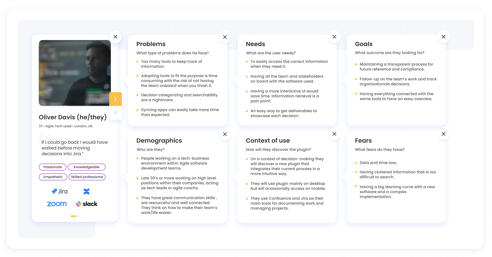

## Project overview



This project was a collaboration with AND Digital, a consultancy agency based in the UK. The brief was first introduced by them three weeks before delivery. We conducted daily 15-minute Agile check-ins and surveyed industry professionals, along with 15 in-depth interviews, to gather qualitative insights.
The business challenge that my team and I tried to solve was to create a solution for highly regulated industries where every decision has to be recorded and documented so that auditors can see a trail from ideation to delivery.
My role was as UX/UI designer along with @Meera Prakash and @Manuella Melo.

| Field   | Role     | Duration   |
| --------  | -------- | ------ |
| *software development* | *ux/ui designer*` | `3 weeks` |

## Project Timeline & my contributions

The project followed the Design Thinking methodology and the Double Diamond model, utilizing both divergent and convergent thinking. The process was non-linear, with overlaps and iterations throughout the stages.

`1 Research: 3 weeks`

`2 Define: 2 weeks`

`3 Ideate: 1 week`

`4 Prototype: 1 month`

`5 Test: 1 week`

### 1. Research (3 weeks)

**Surveys:**

- 38 participants
- Developed a 12-question survey on Google Forms, targeting agile teams recording decisions for compliance.
- My contribution: Designed and distributed the survey with stakeholders, analyzed responses to identify existing tools, key challenges, and decision documentation practices.


**Interviews:**

- Conducted 6 user interviews to understand behaviors regarding decision recording and searching.
- My contribution: Prepared interview guides, conducted interviews, and extracted insights used to build user journey maps and personas.


### 2. Define (2 weeks)

**Empathy Map:**

- Created an Affinity Diagram and Empathy Map to visualize and analyze user behaviors and attitudes.
- My contribution: Synthesized insights from interviews and surveys to create these maps.


**Personas:**

- Developed a persona, "Oliver," an Agile Tech Lead, to guide the product development process.
- My contribution: Led the creation of the persona based on research data, using it to inform ideation and problem statements.



**Problem Statement:**

- Defined the core problem: Existing tools lacked effective decision tracking and categorization, leading to documentation loss and inefficiency.
- My contribution: Drafted the problem statement based on user pain points.

**Moscow Method:**

- Prioritized features using the Moscow method (Must-have, Should-have, Could-have, Can’t-have).
- My contribution: Helped stakeholders align priorities with user needs, especially the integration with Confluence and Jira.


### 3. Ideate (1 week)

**Ideation (Round Robin):**

- Brainstormed design options for decision cards and dashboards, incorporating user flows.
- My contribution: Facilitated the ideation sessions, incorporating user feedback from research.

**User Journey & Flows:**

- Mapped out the current and future scenarios for decision recording and searching tasks, focusing on Oliver's interaction with the solution.
- My contribution: Developed user flows (happy and unhappy paths), ensuring alignment with research insights.

 


### 4. Prototype (1 month)

**Wireframes:**

- Created mid-fidelity prototypes in Figma, illustrating the decision dashboard and decision cards.
- My contribution: Designed the wireframes and iterated based on usability feedback from testing.

**Information Architecture:**

- Built a sitemap using Confluence's navigation patterns, improving existing flows.
- My contribution: Evaluated the structure via heuristic reviews, identifying pain points in the current flow.


**Competitive Research:**

- Analyzed Confluence, Jira, and Microsoft Teams' decision-recording processes to inform our template design.
- My contribution: Conducted competitive research and participated in design sprints to iterate rapidly.


### 5. Test (1 week)

**Usability Testing (3 Rounds, 54 Testers):**

- Conducted tests on the MVP using Maze and collected feedback to enhance decision-making flows.
- My contribution: Recruited testers, conducted remote testing sessions, and iterated the design based on results.

**Card Sorting (2 Tests, 14 Testers):**

- Organized information for decision card structure and search options, refining complex search features.
- My contribution: Led the card sorting process, analyzed results, and used them to improve the IA and search functionality.

### Design System & High-Fidelity Prototypes

**Design System:**

- Established a design system for mid-fidelity prototypes, ensuring consistency with Confluence's UI.
- My contribution: Built the initial design system and maintained its consistency throughout iterations.

**High-Fidelity Designs & Atlassian Tokens:**

- Integrated Atlassian’s design tokens and foundations into the final prototype, refining typography, grids, and components.
- My contribution: Managed the implementation of the tokens, adhering to Atlassian’s design guidelines.

### Final Outcomes:

- Developed a seamless decision-tracking plugin integrated with Confluence and Jira.
- The design iterations, usability tests, and card sorting significantly improved the user experience.

<!--Hugo theme Stack supports the creation of interactive image galleries using Markdown. It's powered by [PhotoSwipe](https://photoswipe.com/) and its syntax was inspired by [Typlog](https://typlog.com/).

To use this feature, the image must be in the same directory as the Markdown file, as it uses Hugo's page bundle feature to read the dimensions of the image. **External images are not supported.**

## Syntax

```markdown
 
```

## Result

 

> Photo by [mymind](https://unsplash.com/@mymind) and [Luke Chesser](https://unsplash.com/@lukechesser) on [Unsplash](https://unsplash.com/)
