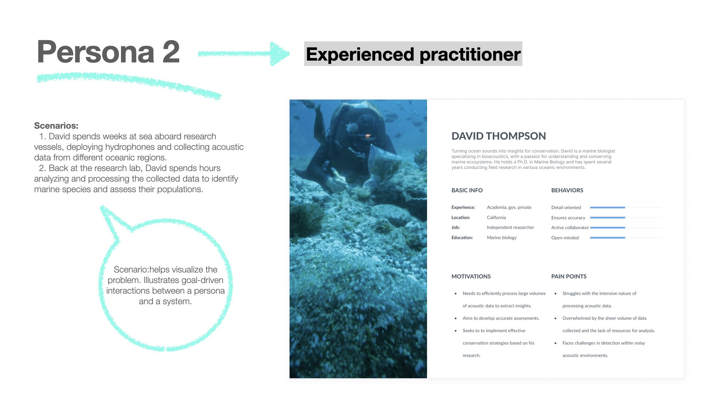

## Project overview

Bioacoustics Learn (BL) integrates online repositories to curate technical content for marine and terrestrial bioacousticians, featuring a scalable design system developed with variable parameters for enhanced usability. Community-driven user testing and research informed continuous improvement and iterations.

| Field   | Role     | Duration   |
| --------  | -------- | ------ |
| *bioacoustics* | *lead designer*` | `3 months` |

## Project Timeline

The project followed the Design Thinking methodology and the Double Diamond model, incorporating both divergent and convergent thinking. It was not linear, with overlaps and iterations occurring from the early stages.

`1 Research: 3 weeks`

`2 Define: 2 weeks`

`3 Ideate: 1 week`

`4 Prototype: 1 month`

`5 Test: 1 week`  

## Step 1: Research

In the field of bioacoustics, user research was vital for supporting the work of bioacousticians, with a primary focus on understanding the behaviors and needs of both **human users** and **marine and terrestrial animal subjects** interacting with sound-based technologies. This multidisciplinary approach involved contextual online analysis, thematic analysis, and interaction analysis through observation, long interviews with open-ended questions and specific instances of interaction within mailing subscription lists, Stack Exchange bioacoustics, Wild Labs, among others. These platforms facilitated the collection of insights into the ways bioacousticians navigate the precise analysis and interpretation of complex acoustic data through the use of multiple software and analysis techniques. The user research also included a literature review of 15 academic papers related to the topic to understand more about the workflow of bioacousticians. Additionally, a snowballing effect was utilized to reach individuals through provided contacts, resulting in 21 survey participants and 5 initial interviews. Grounded in the knowledge of animal behaviors and needs, these techniques provide valuable insights for the development of bioacoustic monitoring solutions and the design of intuitive interfaces to enhance the work of bioacousticians.

User research: mixed methods

| Research type  | Tool     | Literature review   |
| --------  | -------- | ------ |
| *Primary* | Survey | `21 participants` |
| *Primary* | Interviews | `5 interviews` |
| *Secondary* | Literature review | `15 papers` |
| *Secondary* | Contextual | `7 channels` |

  

## Step 2: Define

In the first convergent phase of the project, eight problem statements were defined and asked for validation from a small group of users. As the field was unknown prior to this project, it was important to validate at an early stage the main problem. After receiving some answers a user suggested that focusing on a single software was not a good approach since several softwares were needed at different moments.

> - ***Problem statement:** the user needs guidance in selecting the most suitable tools for processing and visualizing large volumes of marine data.*
> - ***How might we** develop a decision-making tool that can assist the user.*

Four personas were created to illustrate the different needs of users: primary persona wants to get a grip and learn new software to conduct research for her PhD. It was also considered someone coming from another background like data scientist.

   

The competitor analysis was created through element and combined with pluses and deltas allowed to visualize the patterns in learning center and how did users felt about them. Microsoft Learn was considered as *best-in-class* and the task analysis was conducted with it.

 

To streamline the learning experience and reduce barriers to entry, a userflow was created. Through iterations, it was defined that fewer steps are needed to start learning, with no log in or sign up required to begin. To better understand and support the user's educational goals, a user journey was mapped out. Considering that the user goal is to take a course to apply it later in their research, the range of available courses was expanded based on user validations.

 

## Step 3: Ideate

The ideation stage, characterized by divergent thinking, began with a design studio involving three participants (including myself). The primary goal was to generate ideas and validate them collaboratively through iterative processes. The participants, while not bioacousticians, were scientists working in academia. This session was highly successful, as it introduced the main concepts and identified how users prefer to receive information and the types of information that are important to them. Having previously mapped out an initial information architecture proved crucial. By the end of the session, key ideas agreed upon included the selection of learning paths and the option to filter courses to match users' specific needs and the importance of an effective onboarding process.

### Design studio

    

## Step 4: Prototype

Description of step 4...
Content related to step 4.

| Devices   | Design strategy     | Platform   |
| --------  | -------- | ------ |
| `desktop, tablet, mobile` | `desktop first` | `IOs` |

 

## Step 5: Test

Description of step 5...
Content related to step 5.

 

## Survey

Tables aren't part of the core Markdown spec, but Hugo supports supports them out-of-the-box.
| Participants | Seniority |
| -------- | ------ |
| Bob | 27 |
| Alice | 23 |

### Inline Markdown within tables

| Italics   | Bold     | Code   |
| --------  | -------- | ------ |
| *italics* | **bold** | `code` |

## Syntax

```markdown
 
```

## Result

 

## Trying gif


> Photo by [mymind](https://unsplash.com/@mymind) and [Luke Chesser](https://unsplash.com/@lukechesser) on [Unsplash](https://unsplash.com/)

Welcome to Hugo theme Stack. This is your first post. Edit or delete it, then start writing!

For more information about this theme, check the documentation: <https://stack.jimmycai.com/>

Want a site like this? Check out [hugo-theme-stack-stater](https://github.com/CaiJimmy/hugo-theme-stack-starter)

> Photo by [Pawel Czerwinski](https://unsplash.com/@pawel_czerwinski) on [Unsplash](https://unsplash.com/)
