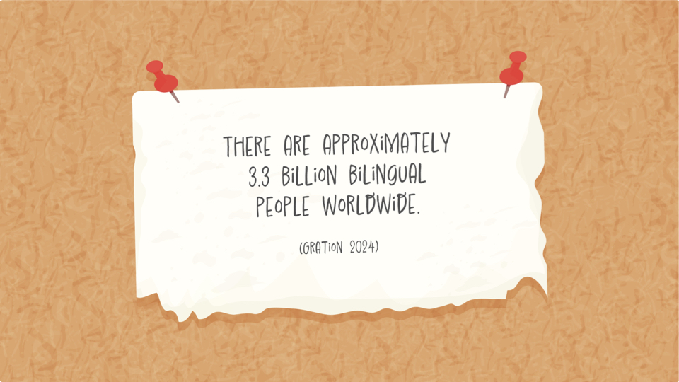
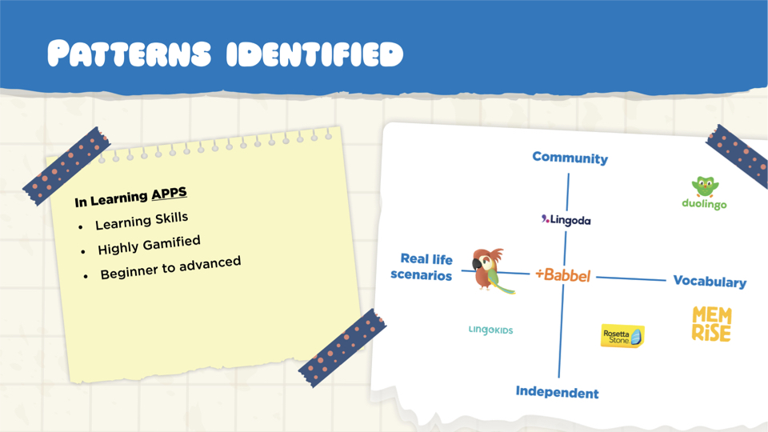
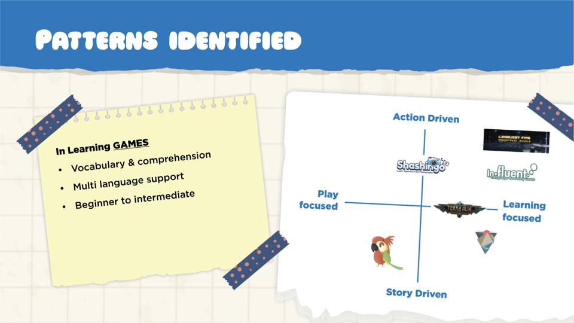

---
title: Language Game Development
description: Creating an engaging, language-based game from concept to launch.
date: 2024-08-15 00:00:00+0000
image: cover.jpg
categories:
    - Game design
    - Market research
    - Unity
    - Language learning
    - Development
--
# Game concept and Experience

Nomad's Notes is a wholesome adventure game that immerses players into a world of language and culture. Embark on a charming adventure as one of the world’s natural travelers to learn new languages, meet delightful characters, and journal your experiences.

For more details, the PC version of the game can be downloaded [here](https://foxracinggurl.itch.io/nomads-notes).

## Game Runthrough



## Project Overview

Nomad's notes is a collaborative end-to-end game developed as a joint project between Indie Game developers and User Experience master students from Falmouth University. The PC game embraces our cosmopolitan nature offering a combination of language learning and entertainment. The team member members were: Jess Bradshaw (Artist, Developer), Kristen Hickey (Illustrator, UX/UI), Sofía Orellano (UX/UI, Localization), Ben Watson (Developer).

| Field   | Role     | Duration   |
| --------  | -------- | ------ |
| *gaming* | *ux/ui designer*` | `3 months` |

<!--## Project Timeline

As a collaborative project, the division of tasks mainly followed each area of expertise. Therefore, user research, academic research, market analysis, user validation and user testing were conducted by the User Experience Designers while the gaming concept, art and development, was led by the Indie Game Developers. 

`1 Initial Research and Planning: 2 weeks`

`2 Ideation and Concept Development: 2 weeks`

`3 Research: 2 weeks`

`4 Define: 2 weeks`

`5 Game Design & Mechanics: 6 weeks`

`4 Pitch Preparation: 2 weeks`

`5 User Testing & Feedback: 1 week`  

## Step 1: Initial Research and Planning

Given the 5-hour time zone difference, it was crucial to carefully select collaborative tools that would enable seamless communication and coordination. The initial planning phase also involved team-building activities to help us understand each member's strengths, which informed decisions about project direction and performance goals for each stage. Early discussions centered around whether to develop a gamified app or a full game. Since the developers had limited experience with app development and the timeline was tight, we collectively decided to focus on creating a game to avoid potential delays from the learning curve.

| Code repository   | Project management     | Communication   | Design | Development | Cloud | Coding |
| --------  | -------- | ------ | ------ |
| *Github* | *Jira* | *Discord* | *Figma, Adobe suite, Miro* | *Unity, Procreate, Inkle* | *One Drive* | *Visual Studio Code* |
 

## Step 2: Ideation and Concept Development

We conducted a rapid, asynchronous ideation session using a Miro board to collaboratively explore potential directions for the project. After the initial brainstorming round, we followed up with a second round of voting, which helped us narrow down and select the final concept: designing a language learning game.

For more details, the Miro Board can be viewed [here](https://miro.com/app/board/uXjVKCIC-pQ=/).

## Steps 3 & 4: Research and Define

Research was conducted across three key areas to identify market gaps, understand industry trends, and explore effective learning paths. The first area focused on market research, aiming to uncover unmet needs and analyze current offerings. User research was also carried out to understand player preferences, behaviors, and motivations, ensuring a connection with users and their expectations. Lastly, academic research examined the most effective language-learning techniques and recent applications. The ultimate goal was to innovate and create something of real value that not only resonated with users but also provided a unique experience they couldn’t easily find elsewhere.

   

## Steps 5: Game Design & Mechanics

While the Indie Game Developers led this step, it was a valuable opportunity for collaboration, particularly in game mechanics and user experience. My contribution focused on the information architecture and menu design, ensuring both were aligned with accessibility guidelines. I also worked on the navigation and interaction features within the in-game journal, enhancing the user experience by making it intuitive and engaging. Several iterations were made to ensure that these elements matched the art style and overall tone of Nomad’s Notes.

Localization and narrative development were other key areas where I contributed. Based on survey results, we chose to create a Spanish-learning experience, starting with Valencia as the first in-game destination. I wrote the character dialogue for a coffee shop scene and collaborated with native Spanish speakers for voice-overs. This native input brought an added layer of authenticity, enriching both the language learning and cultural experience for players. 

## Steps 5: Pitch preparation



Preparing the pitch involved presenting our project to an expert gaming panel, where we received valuable feedback on both the investor pitch and the overall presentation of the game. The feedback was largely positive, with key suggestions focusing on refining the pitch by including data sources to avoid distracting investors and improving character design to differentiate from Duolingo (which also featured birds).

In response, I expanded the market research, analyzing multiple sources such as Nasdaq, Video Games Insights, Statista, and McKinsey. To further distinguish our game from Duolingo, I explored various design approaches—switching character colors, adding accessories, and embracing diversity by incorporating different creatures, such as bees and other animals, to create a more unique and inclusive cast.

## Steps 6: User testing

To validate the concept and using the pitch practise as a reference, we created a User validation form and distributed it among a small audience to gain some early feedback on the concept and the learning side of the game. A user testing form was also created to allow users to test the game in action. Unfortunately, as the game was being developed until the last minute there was no time to conduct user research. 

The results from the user validation form indicated that our user sample followed the industries trends and the most used app was Duolinguo.

<!--## Bilibili video



## Tencent video



## YouTube video

<-->

<!--## Generic video file



## Gist



## GitLab

-->

## Quote

>
Lorem ipsum dolor sit amet, consectetur adipiscing elit, sed do eiusmod tempor incididunt ut labore et dolore magna aliqua. Ut enim ad minim veniam, quis nostrud exercitation ullamco laboris nisi ut aliquip ex ea commodo consequat. Duis aute irure dolor in reprehenderit in voluptate velit esse cillum dolore eu fugiat nulla pariatur. Excepteur sint occaecat cupidatat non proident, sunt in culpa qui officia deserunt mollit anim id est laborum.


-----

> Photo by [Codioful](https://unsplash.com/@codioful) on [Unsplash](https://unsplash.com/photos/WDSN62Qdxuk)

[def]: 6.jpeg