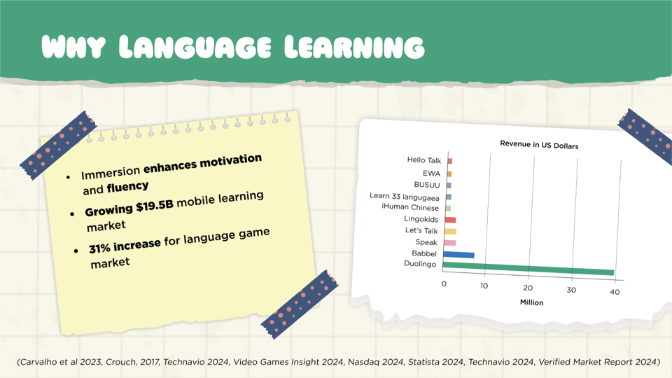
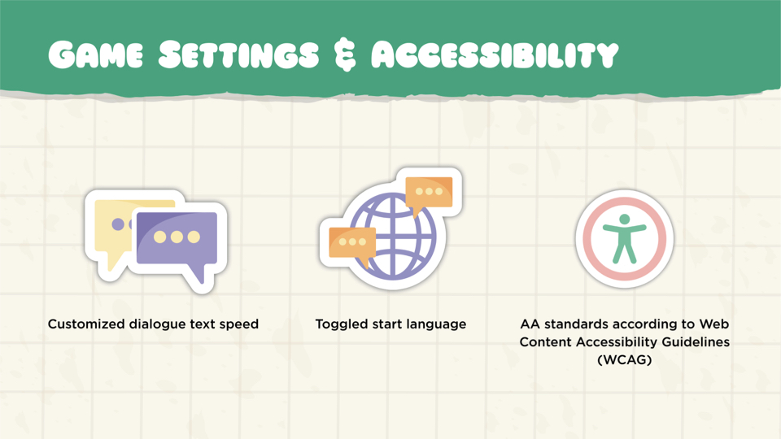
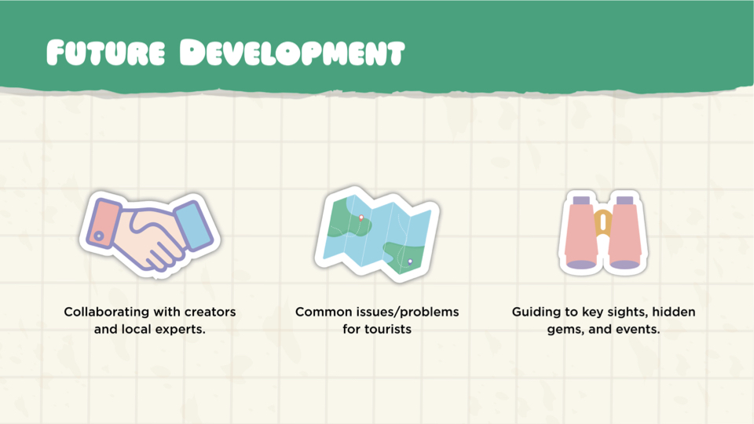

---

title: Language Game Development

description: Creating an engaging, language-based game from concept to launch.

date: 2024-08-15 00:00:00+0000

image: cover.jpg

categories:

    - Game design
    - Market research
    - Unity
    - Language learning
    - Development
--

# Game concept and Experience

Nomad's Notes is a wholesome adventure game that immerses players into a world of language and culture. Embark on a charming adventure as one of the world’s natural travelers to learn new languages, meet delightful characters, and journal your experiences.

For more details, the PC version of the game can be downloaded [here](https://foxracinggurl.itch.io/nomads-notes).

## Game Runthrough



## Project Overview

Nomad's notes is a collaborative end-to-end game developed as a joint project between Indie Game developers and User Experience master students from Falmouth University. The PC game embraces our cosmopolitan nature offering a combination of language learning and entertainment. The team members are: Jess Bradshaw (Artist, Developer), Kristen Hickey (Illustrator, UX/UI), Sofía Orellano (UX/UI, Localization), Ben Watson (Developer).

| Field   | Role     | Duration   |
| --------  | -------- | ------ |
| *gaming* | *ux/ui designer*` | `12 weeks` |

<!--## Project Timeline & my contribution

As a collaborative project, the division of tasks mainly followed each area of expertise. My contribution covered areas of user research, academic research, market analysis, information architecture, prototyping, user validation, and user testing.

`1 Initial Research and Planning (2 weeks): team coordination, project setup, communication management`

`2 Ideation and Concept Development (2 weeks): ideation facilitation, concept refinement`

`3 Research (2 weeks): academic research, user insights`

`4 Define (2 weeks): mapping and market analysis`

`5 Game Design & Mechanics (8 weeks): information Architecture, prototypying & interaction`

`4 Pitch Preparation (2 weeks): market focus`

`5 User Testing & Feedback (1 week): creation and data analysis`  

## Step 1: Initial Research and Planning

Given the 5-hour time zone difference, it was crucial to carefully select collaborative tools that would enable seamless communication and coordination. My contribution during this stage involved setting up the initial meetings, helping to establish a comfortable environment for the team, and ensuring smooth communication across time zones. I also created the GitHub repository to manage the project’s codebase and established the first project charter, outlining performance goals, expected outcomes, and a high-level timeline for the weeks ahead.

The initial planning phase included team-building activities to help us understand each member's strengths, which informed decisions about project direction and goals for each stage. Early discussions centered around whether to develop a gamified app or a full game. Since the developers had limited experience with app development and the timeline was tight, we collectively decided to focus on creating a game to avoid potential delays from the learning curve.

| Code repository   | Project management     | Communication   | Design | Development | Cloud | Coding |
| -------- | -------- | ------ | ------ | ------ | ------ | ------ |
| *Github* | *Jira* | *Discord* | *Figma, Adobe suite, Miro* | *Unity, Procreate, Inkle* | *One Drive* | *Visual Studio Code* |

## Step 2: Ideation and Concept Development

We conducted a rapid, asynchronous ideation session using a Miro board to collaboratively explore potential directions for the project. After the initial brainstorming round, we followed up with a second round of voting, which helped us narrow down and select the final concept: designing a language learning game.

For more details, the Miro Board can be viewed [here](https://miro.com/app/board/uXjVKCIC-pQ=/).

## Steps 3 & 4: Research and Define

Research was conducted across three key areas to identify market gaps, understand industry trends, and explore effective learning paths. I led the academic research, examining effective language-learning techniques and recent applications. I also conducted user interviews and distributed surveys to understand player preferences, behaviors, and motivations, ensuring a strong connection with our target users.

Market research was another major focus, where I analyzed current offerings and uncovered unmet needs. This included conducting an affinity analysis to identify patterns in both language-learning apps and educational games. In addition, I interviewed an industry expert to gather insights that informed our pitch preparation.

The ultimate goal was to innovate and create something of real value that resonated with users, while providing a unique experience they couldn’t easily find elsewhere.

   

## Steps 5: Game Design & Mechanics

While the Indie Game Developers led this step, it was a valuable opportunity for collaboration, particularly in game mechanics and user experience. My contribution focused on the information architecture and menu design, ensuring both were aligned with accessibility guidelines. I also worked on the navigation and interaction features within the in-game journal, enhancing the user experience by making it intuitive and engaging. Several iterations were made to ensure that these elements matched the art style and overall tone of Nomad’s Notes.

Localization and narrative development were other key areas where I contributed. Based on survey results, we chose to create a Spanish-learning experience, starting with Valencia as the first in-game destination. I wrote the character dialogue for a coffee shop scene and collaborated with native Spanish speakers for voice-overs. This native input brought an added layer of authenticity, enriching both the language learning and cultural experience for players.

[Design pillars](14.jpeg) 

## Steps 5: Pitch preparation



Preparing the pitch involved presenting our project to an expert gaming panel, where we received valuable feedback on both the investor pitch and the overall presentation of the game. The feedback was largely positive, with key suggestions focusing on refining the pitch by including data sources to avoid distracting investors and improving character design to differentiate from Duolingo (which also featured birds).

In response, I expanded the market research, analyzing multiple sources such as Nasdaq, Video Games Insights, Statista, and McKinsey. To further distinguish our game from Duolingo, I explored various design approaches—switching character colors, adding accessories, and embracing diversity by incorporating different creatures, such as bees and other animals, to create a more unique and inclusive cast.

## Steps 6: User testing

To validate the concept, we created a [user validation form] (https://docs.google.com/forms/d/e/1FAIpQLSeG2cV8M9Th-uazXBfynRTGvkK0BwlurVRDz1wtnA_jUrZkUw/viewform) and distributed it to a small audience for early feedback on the game’s concept and language-learning features. Additionally, a [user testing form] (https://docs.google.com/forms/d/1Mo_XcGVWYE6tfgvGaDr-gtkredFqT9r_WXiTnyPEdac/edit) was developed to gather input from users playing the game. However, due to time constraints with the development process, there wasn’t enough time to conduct thorough user research. Despite this, user validation revealed strong engagement with the game’s language-learning mechanics, and feedback highlighted the intuitive design and cultural immersion as key strengths.

[Future development](26.jpeg)

## Quote

>
This is one of the best presentations I've seen when it comes to the Market Research, both in terms of how the market research was conducted, but more importantly, how it was applied. It is clear that the market research has been done with a genuine curiousity for learning about what users would actually want, and those learnings have been directly applied to the end product to create something that would have appeal.
The demo is very well polished and gives a good representation of what the end user would expect, which is a great for a publisher/investor. The art is cohesive throughout including the characters and environments, and has been designed in a way that makes it fun to explore. There is a good balance between language learning and cultural exploration, and the way the language is expressed in the demo feels like a natural way to immerse. Spanish words and sentences are presented in a variety of ways which keeps things interesting and would help users who have different learning styles. The journal helps to solidfy the activities and for the full game, would provide a natural resting point for the player to evaluate their learnings and stop playing for the day. I can see how players would use this game in a cyclical manner.


-----

> Photo by [Codioful](https://unsplash.com/@codioful) on [Unsplash](https://unsplash.com/photos/WDSN62Qdxuk)

[def]:6.jpeg
